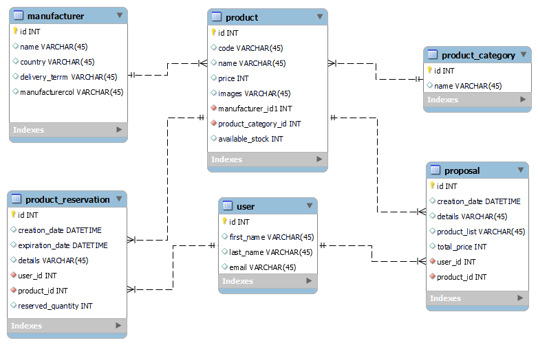

# Administrare app

## About

Administrare app is a personalized software for managing different aspects of an actual
Small Business, similar to an ERP. It uses Java, Maven, Spring Boot, Spring DATA JPA, Hibernate and MySQL for backend
and Thymeleaf with Bootstrap for the frontend.


## Purpose & context
The app should provide the users with easy access to centralized information about to the inventory, providers, 
delivery terms and other related data. The main usage would be searching for the prices which are currently stored
in more than 100 tables in different formats. The next ones would be searching the available stock, making stock 
reservations and creating proposal drafts. Using these features would bring an estimate of 25% raise in productivity.

*The application will be used in production*.

## Features

###### When the user {is not loged in}, should be able to:
- access the "Autentificare" or "Inregistrare" page in order to have access to modify the data;
- access the "Acasa" page to search for products without login;
- view the search results on the "Acasa"" page;
- access detailed view (with a list of reservations, if any) of a record from a link in the record view;
- view a list of local stocks filtered by category;
- access the "Rezervari" page to view and search for reservations;
- **optional - access and use the "Calculator profile" (profiles calculator) page;

###### When the user {is loged in}, should be able to:
- edit/delete a record from the "Acasa" page view when logged in;
- access the page "Adaugare" to add products or providers when logged in;
- add/edit/remove reservations when logged in;
- receive reminders by email when reservations expire;
- create and export proposal draft;
- upload tables to database;
- add/modify categories;
- add/modify users and assign roles as an administrator;
- view and export the logs as an administrator;

## Optional features
###### The user should be able to:
- access and use the "Calculator sisteme de profile" page (profile systems calculator) without login;
- access and view a statistics page without login;


### Initial schema diagram




### Progress tree

```aidl
├── mvnw
├── mvnw.cmd
├── pom.xml
├── readme.md
└── src
├── main
│   ├── java
│   │   └── com
│   │       └── luminna
│   │           └── administrare
│   │               ├── AdministrareApplication.java
│   │               ├── controller
│   │               │   ├── MainController.java
│   │               │   ├── ProductCategoryController.java
│   │               │   ├── ProductController.java
│   │               │   ├── ProposalController.java
│   │               │   ├── ProviderController.java
│   │               │   ├── ReservationController.java
│   │               │   └── UserController.java
│   │               ├── entity
│   │               │   ├── ProductCategory.java
│   │               │   ├── Product.java
│   │               │   ├── ProposalItem.java
│   │               │   ├── Proposal.java
│   │               │   ├── Provider.java
│   │               │   ├── ReservationItem.java
│   │               │   ├── Reservation.java
│   │               │   └── User.java
│   │               ├── repository
│   │               │   ├── ProductCategoryRepository.java
│   │               │   ├── ProductRepository.java
│   │               │   ├── ProposalRepository.java
│   │               │   ├── ProviderRepository.java
│   │               │   ├── ReservationRepository.java
│   │               │   └── UserRepository.java
│   │               └── service
│   │                   ├── ProductCategoryService.java
│   │                   ├── ProductService.java
│   │                   ├── ProposalService.java
│   │                   ├── ProviderService.java
│   │                   ├── ReservationService.java
│   │                   └── UserService.java
│   └── resources
│       ├── application.properties
│       ├── static
│       │   └── pics
│       │       └── administrare_db_diagram.png
│       └── templates
│           ├── add-product.html
│           ├── add-user.html
│           ├── autentificare.html
│           ├── index.html
│           └── update-user.html
└── test
    └── java
        └── com
            └── luminna
                └── administrare
                    ├── AdministrareApplicationTests.java
                    └── repository
                        ├── ProductRepositoryTest.java
                        └── ProviderRepositoryTest.java

```


### TODO
- [ ] Finish the views;
- [ ] Wire the controllers to the views;
- [ ] Implement the **Local stock** (id, product code (fk), category, in stock, reservations, available quantity);
- [ ] Implement the **Reservation** (id, product code (fk), reserved quantity, user, reservation date, other details)
- [ ] **Optional - Implement the **Proposal draft** (id, title, user, creation date, list of products) with export in 
Excel file;
- [ ] Implement Security/login feature;
- [ ] Implement proper Unit tests;
- [ ] Implement the **Pictures** feature; 
- [ ] Implement Pagination;
- [ ] Handle the Exceptions;
- [ ] Implement the **Log** feature;


### Issues
- I was able to create a product with the HTTP POST method by including the provider details in the product's body.
However, I need to be able to just reference the provider with its ID. The provider object does not allow adding another product with
the same provider ID (the provider has a unique constraint). 
  - I've found out I should reference the provider's ID only.
- 
